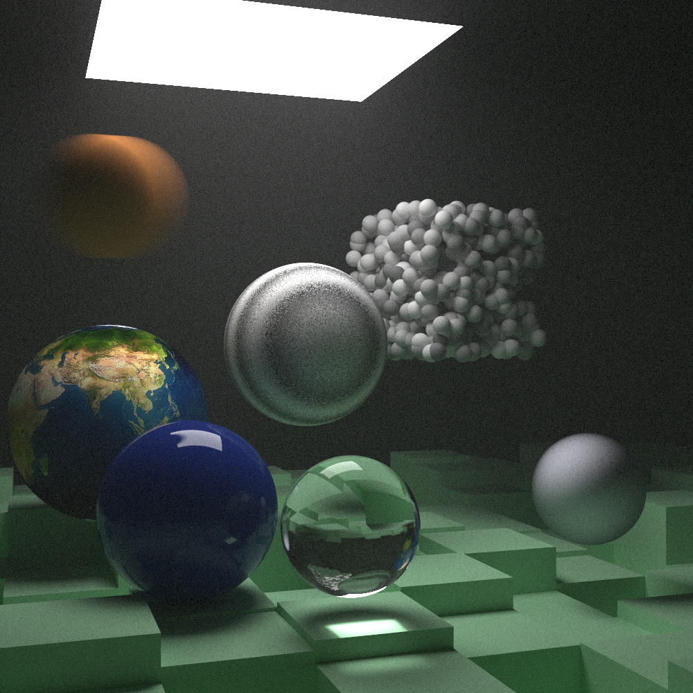
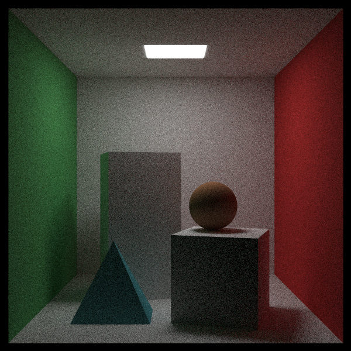
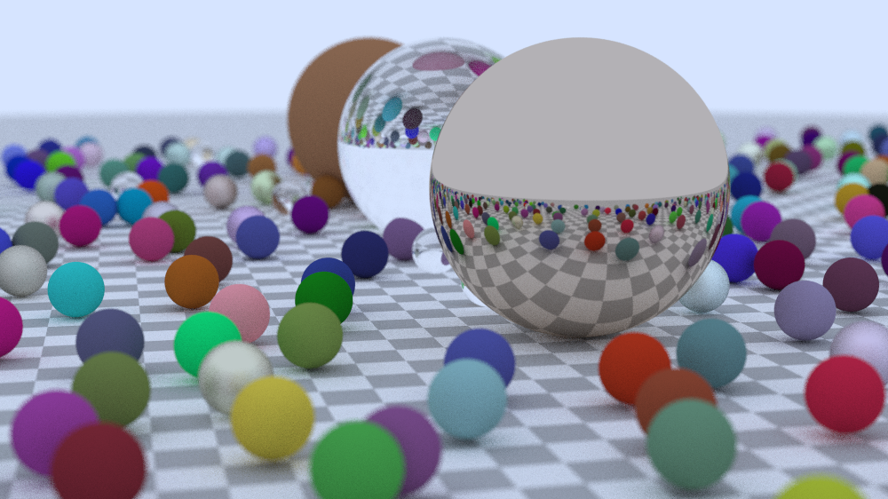

# Ray tracing in one weekend, with SIMD
An optimized implementation of Peter Shirley’s classic ray tracing series: [*Ray Tracing in One Weekend*](https://raytracing.github.io/books/RayTracingInOneWeekend.html) and [*Ray Tracing: The Next Week*](https://raytracing.github.io/books/RayTracingTheNextWeek.html).  This version is written in **modern C++17**, enhanced with **SIMD intrinsics** and **OpenMP multithreading** for high performance.  

### Preview:






## Features Added

Peter Shirley’s originals were intentionally C-style. This project reimagines them with **modern C++ practices** and performance optimizations:  

Some features added:
- Generic vector class: implemented a generic N-dimensional vector class.
- Image writer: Instead of relying on PPM files, which is very slow and cumbersome, I implemented an image writer using stb_image_write. It supports multiple output formats, including PPM, PNG, JPEG, BMP, and TGA.
- Multithreading: Initially, I implemented a custom thread pool, but later transitioned to OpenMP for simplicity and better performance (skill issue on my part).
- Tile-based rendering: The image is divided into tiles for more efficient parallel rendering.
- CPU SIMD intrinsics: Used for optimized vector operations and improved performance.

## Building with CMake
### External dependencies used:
- [stb_image_write](https://github.com/nothings/stb/blob/master/stb_image_write.h)
- [stb_image](https://github.com/nothings/stb/blob/master/stb_image.h)

### Requirements
- C++17 (GCC ≥ 9, Clang ≥ 10, or MSVC ≥ 2019)
- [CMake](https://cmake.org/) ≥ 3.15
- OpenMP support (optional but recommended for multithreading)
- Intel/AMD cpu

### Build Instructions
```bash
# Clone the repository
git clone https://github.com/hilbertcube/SIMD-raytracer.git
cd SIMD-raytracer

# Create a build directory
mkdir build && cd build

# Configure the project
cmake .. -DCMAKE_BUILD_TYPE=Release

# Build the project
cmake --build .
```

### Running

After building, you’ll find the executable inside the build/ directory:
```bash
./SIMD-raytracer
```
By default, it renders the final scene and saves it to `output.png` (or another format if specified).

## Future plans
- CUDA acceleration
- Command line arguments