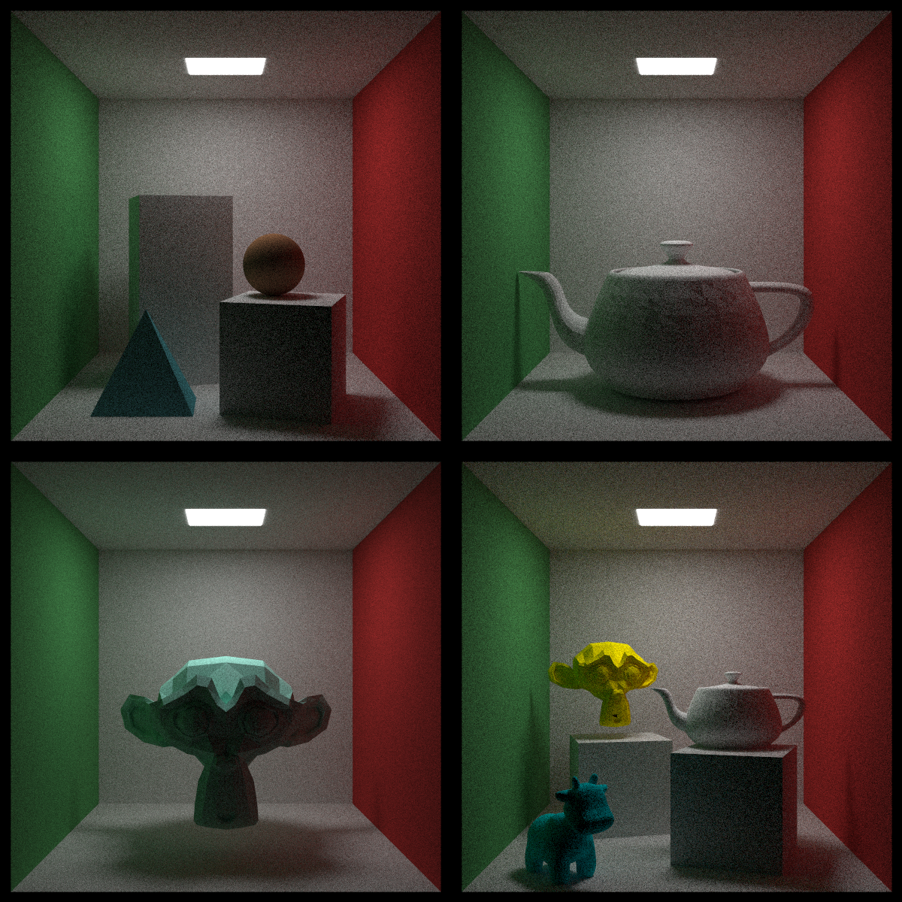
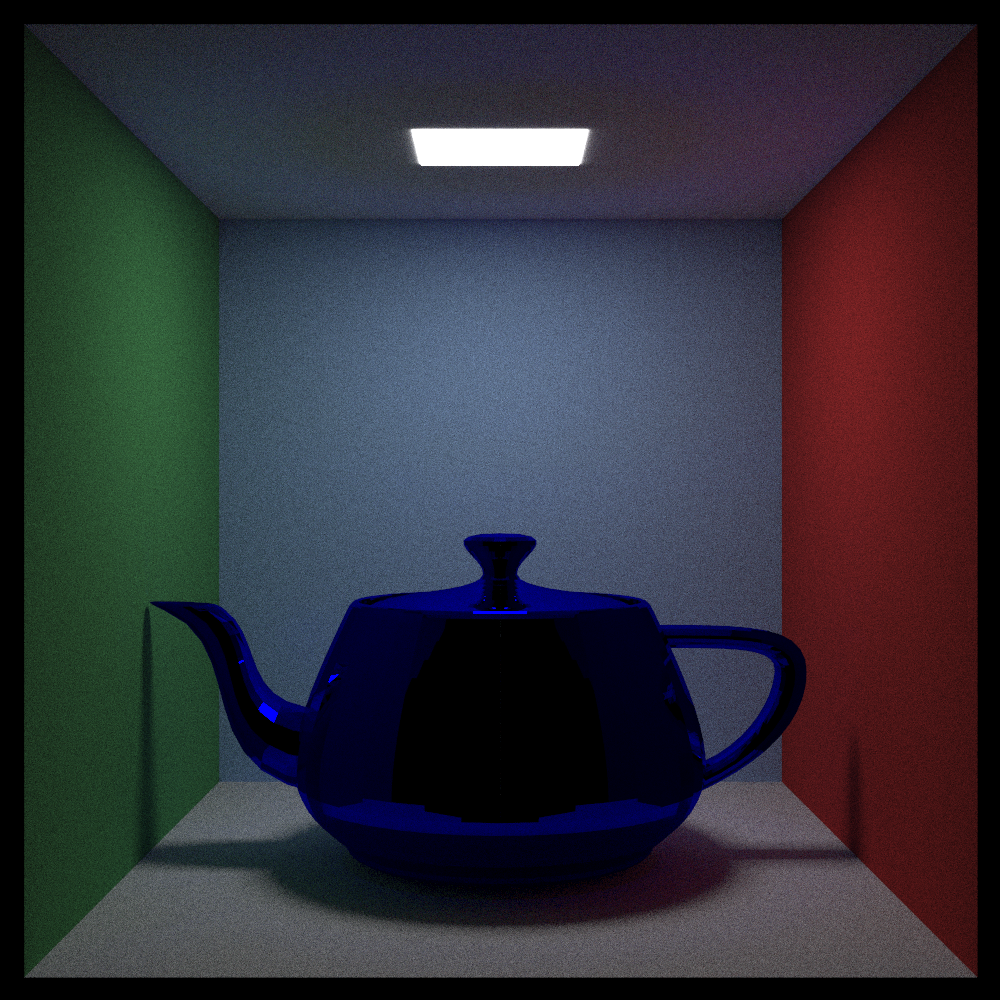
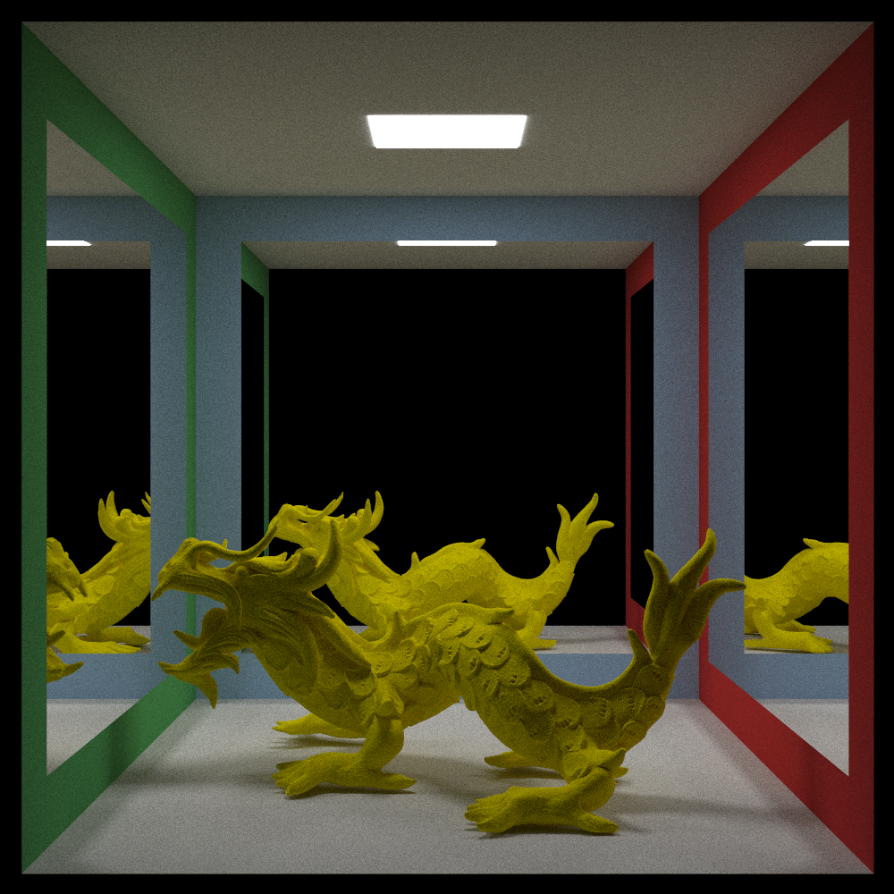

# Ray tracing in one weekend, with SIMD
An optimized implementation of Peter Shirley’s classic ray tracing (actually path tracing) series: [*Ray Tracing in One Weekend*](https://raytracing.github.io/books/RayTracingInOneWeekend.html) and [*Ray Tracing: The Next Week*](https://raytracing.github.io/books/RayTracingTheNextWeek.html). This version is written in C++17, enhanced with SIMD intrinsics and OpenMP multithreading for better performance.

### Preview:







## Features Added

Peter Shirley’s originals were intentionally C-style. This project reimagines them with modern C++ practices and performance optimizations.

Some features added:
- A 3D model importer.
- Generic vector class: implemented a generic N-dimensional vector class.
- Image Writer: Instead of relying on a PPM writer, which is very slow and produces very large files, I implemented an image writer using stb_image_write. It supports multiple output formats, including PPM, PNG, JPEG, BMP, and TGA.
- Multithreading: Initially, I implemented a custom thread pool, but later transitioned to OpenMP for simplicity and better performance (skill issue on my part).
- Tile-based rendering: The image is divided into tiles for more efficient parallel rendering.
- CPU SIMD intrinsics: Used for optimized vector operations and improved performance.

## Building with CMake
### External (header-only) dependencies
- [stb_image_write.h](https://github.com/nothings/stb/blob/master/stb_image_write.h)
- [stb_image.h](https://github.com/nothings/stb/blob/master/stb_image.h)
- [tiny_obj_loader.h](https://github.com/tinyobjloader/tinyobjloader)

### Requirements
- C++17 (GCC >= 9, Clang >= 10, or MSVC >= 2019)
- [CMake](https://cmake.org/)
- OpenMP support

### Build Instructions
```bash
# Clone the repository
git clone https://github.com/hilbertcube/SIMD-Pathtracer.git
cd SIMD-Pathtracer

# Create a build directory
mkdir build && cd build

# Configure the project
cmake .. -DCMAKE_BUILD_TYPE=Release

# Build the project
cmake --build .
```

### Running

After building, you’ll find the executable inside the build/ directory:
```bash
./SIMD-Pathtracer
```
By default, it renders the final scene and saves it to `output.png` (or another format if specified).

### Usage
To enable SIMD, simply add `#define _USE_SIMD_` before `#include "vector.hpp"`, but remember to do this only once, or else just use `#ifndef`.

## Future plans
- CUDA acceleration
- Command line arguments