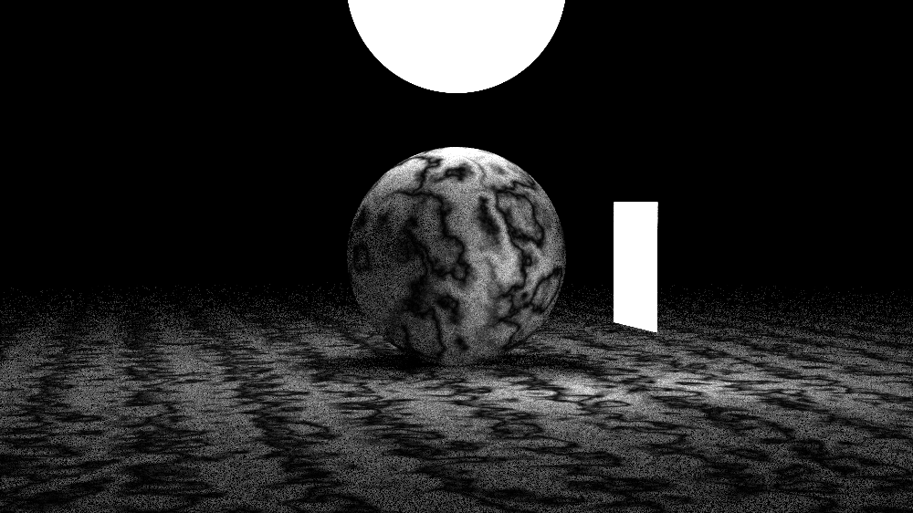

# Ray tracing in one weekend, with SIMD

This is an implementation in modern C++ with SIMD and OpenMP of Peter Shirley's  ["Ray Tracing In One Weekend"](https://SIMD-raytracer.github.io/books/SIMD-raytracerInOneWeekend.html) and ["Ray Tracing: The Next Week"](https://SIMD-raytracer.github.io/books/SIMD-raytracerTheNextWeek.html).

External dependencies:
- [stb_image_write](https://github.com/nothings/stb/blob/master/stb_image_write.h)
- [stb_image](https://github.com/nothings/stb/blob/master/stb_image.h)





## Features Added

While Peter Shirley kept the original ray tracing code closer to C-style, I chose to fully reimplement it using modern C++ (C++17). Why? I really like new features in recent C++ updates, like static_assert, variadic template, nodiscard keyword, and many more.

Some features added:
- Generic vector class: implemented a generic N-dimensional vector class.
- Image writer: Instead of relying on PPM files, which is very slow and cumbersome, I implemented an image writer using stb_image_write. It supports multiple output formats, including PPM, PNG, JPEG, BMP, and TGA.
- Multithreading: Initially, I implemented a custom thread pool, but later transitioned to OpenMP for simplicity and better performance (skill issue on my part).
- Tile-based rendering: The image is divided into tiles for more efficient parallel rendering.
- CPU SIMD intrinsics: Used for optimized vector operations and improved performance.

## Building with CMake

### Requirements
- A C++17 (GCC ≥ 9, Clang ≥ 10, or MSVC ≥ 2019)
- [CMake](https://cmake.org/) ≥ 3.15
- OpenMP support (optional but recommended for multithreading)
- Intel/AMD cpu

### Build Instructions
```bash
# Clone the repository
git clone https://github.com/yourusername/SIMD-raytracer.git
cd SIMD-raytracer

# Create a build directory
mkdir build && cd build

# Configure the project
cmake .. -DCMAKE_BUILD_TYPE=Release

# Build the project
cmake --build .
```

### Running

After building, you’ll find the executable inside the build/ directory:
```bash
./SIMD-raytracer
```
By default, it renders the final scene and saves it to `output.png` (or another format if specified).

## Future plans
- BVH acceleration structure for large scenes

- More advanced materials (glass dispersion, subsurface scattering)

- Motion blur and depth of field tweaks

- CUDA acceleration